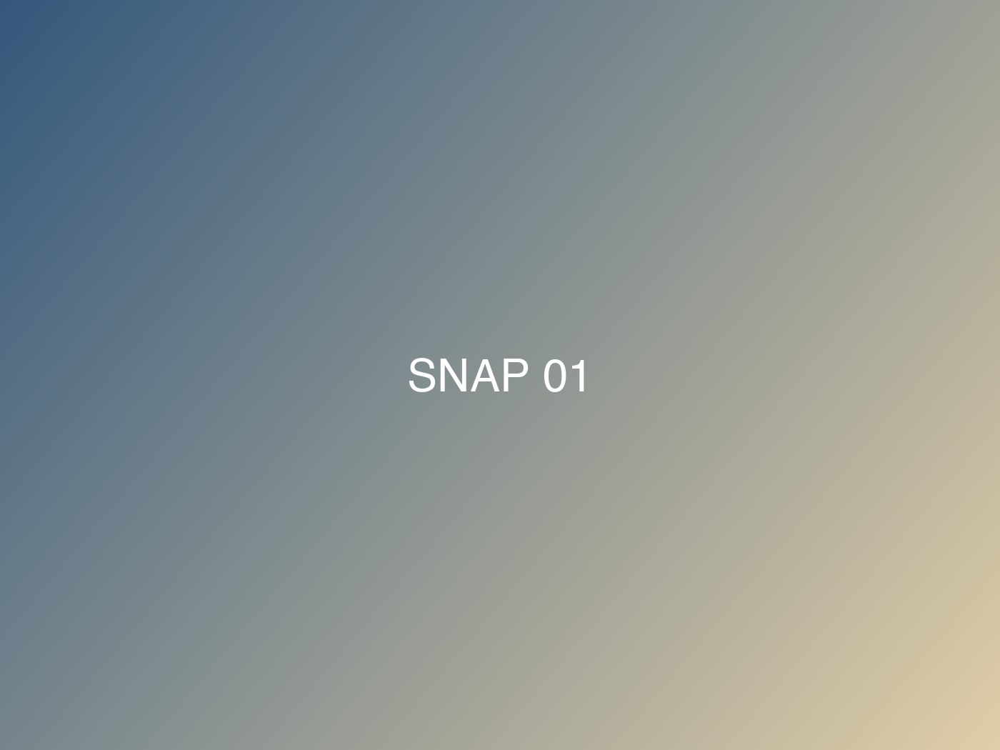

这是一篇示例日志。你可以直接把这段文字全部删掉，写自己的内容。

## 正文怎么写

Markdown 的常用写法都支持：**加粗**、*斜体*、[链接](https://gohugo.io/)、行内 `代码`，以及列表：

- 第一条
- 第二条
- 第三条

> 引用长这样。

## 在文章里插入照片

把照片放进这篇文章所在的文件夹（`content/posts/hello/`），然后用 `photos` 短代码。下面这三张就是这么来的：



单张照片也可以直接用 Markdown 写：

## 关于草稿

文章开头的 `draft: false` 改成 `true`，这篇就不会被发布 —— 本地预览时加上 `hugo server -D` 仍然能看到。
